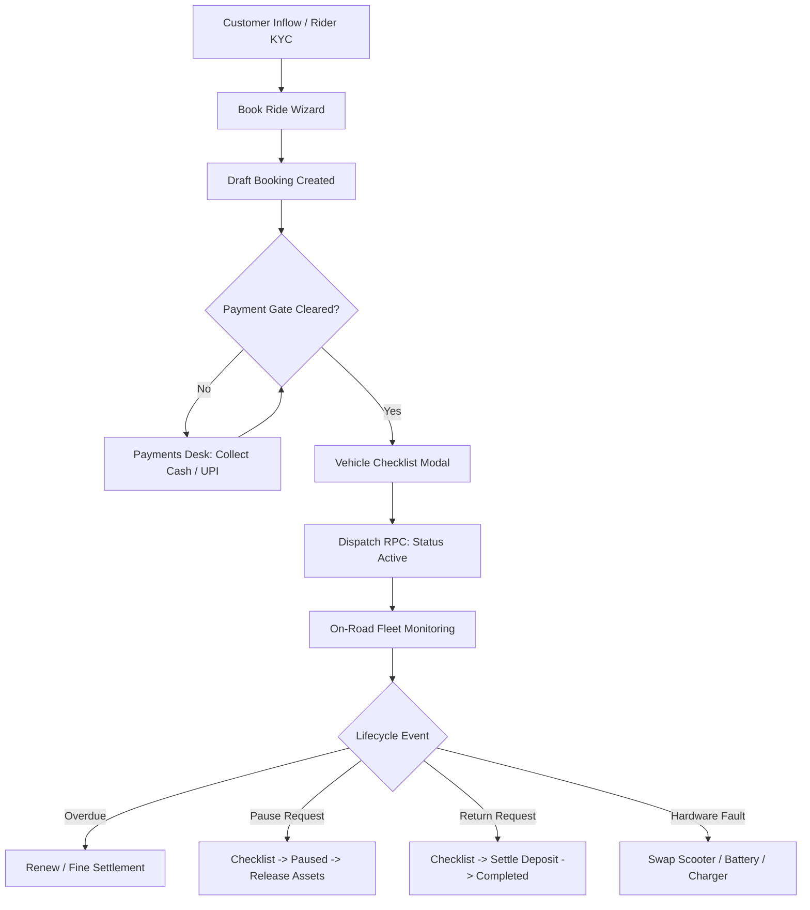
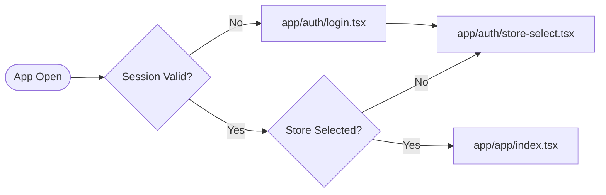
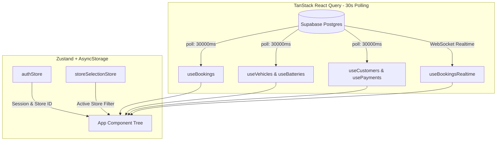
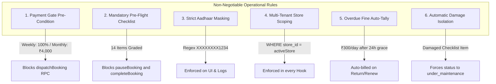

# YanaOperator — Comprehensive Project Reference

> **Developer Technical Manual & Reference Guide**  
> **Target Audience:** Core Developers, Mobile Engineers, Backend Integrators, Technical Operations  
> **Last Updated:** September 2026

---

## Table of Contents
1. [Executive Overview & Metadata](#1-executive-overview--metadata)
2. [Purpose & System Context](#2-purpose--system-context)
3. [Technology Stack](#3-technology-stack)
4. [Directory & Repository Structure](#4-directory--repository-structure)
5. [Screen Catalog & Navigation Architecture](#5-screen-catalog--navigation-architecture)
   - 5.1 [Authentication Flow](#51-authentication-flow)
   - 5.2 [Primary Tab Navigation (5 Visible Tabs)](#52-primary-tab-navigation-5-visible-tabs)
   - 5.3 [Operational Utility Screens (Hidden Tabs / Drawer)](#53-operational-utility-screens-hidden-tabs--drawer)
6. [Modal Components Inventory](#6-modal-components-inventory)
7. [State Management Architecture](#7-state-management-architecture)
   - 7.1 [Client State (Zustand Stores)](#71-client-state-zustand-stores)
   - 7.2 [Server State & Polling (React Query)](#72-server-state--polling-react-query)
8. [Service Layer Specification (`bookingService.ts`)](#8-service-layer-specification-bookingservicets)
9. [Design System & Design Tokens (`design.ts`)](#9-design-system--design-tokens-designts)
10. [Database Architecture & Migrations](#10-database-architecture--migrations)
    - 10.1 [Supabase Migration Ledger](#101-supabase-migration-ledger)
    - 10.2 [Database Type Staleness & Technical Debt](#102-database-type-staleness--technical-debt)
11. [Core Business Rules & Policy Gates](#11-core-business-rules--policy-gates)
12. [Root CSV Seed Data & Ledger References](#12-root-csv-seed-data--ledger-references)

---

## 1. Executive Overview & Metadata

| Attribute | Specification | Notes |
| :--- | :--- | :--- |
| **App Name** | YanaOS Operator App | Also referred to as Operator Hub / Captain Terminal |
| **Package ID** | `com.yana.operator` | Android Application ID |
| **Current Version** | `1.9.0` | Production build |
| **Target Platform** | Android ONLY | Hardened for Android handhelds/tablets at EV hubs |
| **Operating Company** | Yantron Technology Pvt. Ltd. | Bhubaneswar, Odisha, India |
| **EAS Update Channel** | `production` | Over-The-Air (OTA) runtime updates via `expo-updates` |
| **Build Artifact** | Custom Development Build (EAS) | **NOT compatible with standard Expo Go** |

---

## 2. Purpose & System Context

The **YanaOS Operator App** is the frontline operational terminal used by **Captains** (store operators/station managers) deployed at **ZAP Points** (Yana Electric Vehicle Hubs).

Before YanaOperator, hub operations relied on manual paper registers, informal WhatsApp dispatch confirmations, unverified digital payments, and untracked vehicle damage handover. YanaOperator digitizes and enforces:
- **Zero-Trust Dispatching:** Vehicles cannot leave the hub without clearing algorithmic payment gates.
- **Enforced Digital Checklists:** Mandated 14-item physical condition inspection before releasing, pausing, or receiving vehicles.
- **Hardware Asset Tracking:** Real-time pairing and swapping of Scooters, Lithium Battery Packs, and Chargers.
- **Automated Fine & Dues Settlement:** Direct billing for overdue periods (₹300/day after grace period) and structural damages.
- **Offline/Hybrid Capability:** Persistent store selections, 30s background sync, and offline banner fallbacks.



---

## 3. Technology Stack

```
                                  YANA OPERATOR TECH STACK
┌────────────────────────────────────────────────────────────────────────────────────────┐
│ UI / Runtime: React Native 0.76+ | Expo SDK 55 (Custom Dev Client)                     │
├───────────────────────────┬─────────────────────────────┬──────────────────────────────┤
│ Navigation & Routing      │ State Management            │ Data & Persistence           │
│ - Expo Router (file-based)│ - TanStack React Query v5   │ - Supabase Postgres 17 (DB)  │
│ - react-native-reanimated │ - Zustand (vanilla client)  │ - Supabase Auth v2 (JWT)     │
│ - @shopify/flash-list     │ - @react-native-async-stor. │ - Supabase Storage (Buckets) │
├───────────────────────────┼─────────────────────────────┼──────────────────────────────┤
│ Forms & Hardware          │ Payments & Outputs          │ Communications               │
│ - React Hook Form + Zod   │ - Razorpay Native SDK       │ - expo-notifications (Push)  │
│ - Ionicons only           │ - expo-print (PDF reports)  │ - expo-updates (OTA runtime) │
│ - Google Nunito Typography│ - expo-sharing (Export)     │ - Supabase Realtime Channels │
└───────────────────────────┴─────────────────────────────┴──────────────────────────────┘
```

### Detailed Dependencies & Tooling

- **Core Engine:** React Native running on Expo SDK 55 with Custom Android Native Modules.
- **File-Based Routing:** Expo Router (`app/` hierarchy), typed routes, modal presentation targets.
- **Server Cache & Polling:** TanStack React Query configured with a global 30,000 ms (30s) poll interval (`POLL_INTERVAL`) and selective 5-minute/10-minute long caches for static configurations.
- **Local State:** Zustand stores with `@react-native-async-storage/async-storage` serialization.
- **Backend Infrastructure:** Supabase cloud running PostgreSQL 17, PostgREST, Auth v2, and Realtime WebSocket replication.
- **Payments:** Razorpay Android Native SDK for card, UPI, and net-banking deep integration.
- **Performance Lists:** `@shopify/flash-list` for smooth 60fps rendering of 500+ fleet and booking cards.
- **Export Engine:** `expo-print` generating standard HTML-to-PDF receipts and End-of-Day (EOD) audit sheets shared via `expo-sharing`.

---

## 4. Directory & Repository Structure

```
YanaOperator/
├── app/                                  # Expo Router Application Tree
│   ├── _layout.tsx                       # Root Layout: Fonts (Nunito), Splash screen, Auth gating, QueryClient
│   ├── (auth)/                           # Unauthenticated Stack (fade transition)
│   │   ├── _layout.tsx                   # Auth Stack Layout configuration
│   │   ├── login.tsx                     # Email + password sign-in (Supabase Auth v2)
│   │   └── store-select.tsx              # ZAP Point Selector (stores table query)
│   └── (app)/                            # Authenticated Application Space
│       ├── _layout.tsx                   # 5-Tab Bar, YanaHeader, Realtime listeners, Push tokens
│       ├── index.tsx                     # [Tab 1] Ops Center (KPIs, Rental Goal, Overdue feed, Live Bookings)
│       ├── rentals.tsx                   # [Tab 2] Rental Center (Live Board, Master History, Lifecycle CTAs)
│       ├── fleet.tsx                     # [Tab 3] Fleet Status (Scooters & Batteries breakdown)
│       ├── payments.tsx                  # [Tab 4] Payments Desk (Settlement queue, Gate dues)
│       ├── riders.tsx                    # [Tab 5] Riders Registry (Search, Verification, Masked Aadhaar)
│       ├── maintenance.tsx               # [Hidden] Maintenance Bay (Tickets, Parts inventory, Cost logs)
│       ├── performance.tsx               # [Hidden] Captain Appraisal (Cycle timer, Task checklist, Badges)
│       ├── notifications.tsx             # [Hidden] Notification Center (All/Unread/Tasks filters)
│       └── eod.tsx                       # [Hidden] End of Day Audit Report (Live vs Final, PDF export)
├── src/                                  # Source Code
│   ├── components/                       # Shared React Components
│   │   ├── RentalCard.tsx                # Context-aware booking card with status-gated action buttons
│   │   ├── YanaHeader.tsx                # App bar: Logo, Store picker, Role badge, Notification bell
│   │   ├── YanaLogo.tsx                  # Vector SVG brand wordmark
│   │   ├── modals/                       # Modals & Bottom Sheets
│   │   │   ├── BookRideModal.tsx         # Multi-step rental onboarding wizard
│   │   │   ├── CalendarModal.tsx         # Date picker modal with boundary controls
│   │   │   ├── ChecklistModal.tsx        # 14-item vehicle inspection sheet with fine calculator
│   │   │   ├── MaintenanceModals.tsx     # ChecklistModal, RepairPartsModal, RepairCostModal
│   │   │   ├── OpsModals.tsx             # PauseModal, ReturnModal, SwapModal, CustomerFormModal
│   │   │   ├── PaymentModal.tsx          # Payment collection modal (Cash & Online split)
│   │   │   ├── ProfileModal.tsx          # Operator profile summary & daily report trigger
│   │   │   └── RenewModal.tsx            # Subscription extension & overdue settlement modal
│   │   └── ui/                           # Atoms & Primitive UI Elements
│   │       └── index.tsx                 # YanaButton, StatusBadge, PaymentGateBadge, KPICard,
│   │                                     # ProgressBar, SearchBar, SkeletonCard, ErrorBanner,
│   │                                     # OfflineBanner, EmptyState, SectionHeader, Divider, StoreLiveBadge
│   ├── constants/                        # Tokens, Configurations, Static Data
│   │   ├── design.ts                     # Colors, Spacing, Border Radii, Shadows, Typography tokens
│   │   ├── layout.ts                     # Responsive device scaling hook (useLayout)
│   │   └── vehicleChecklistData.ts       # Master 53-item inspection catalog with standard repair fines
│   ├── hooks/                            # Custom Data Hooks
│   │   └── useQueries.ts                 # 20+ TanStack React Query hooks with polling & caching
│   ├── lib/                              # Client Libraries & Types
│   │   ├── supabase.ts                   # Supabase client singleton initialization
│   │   └── database.types.ts             # Generated DB schema definitions (Note: has known staleness)
│   ├── services/                         # Business Logic & RPC Interfaces
│   │   └── bookingService.ts             # 29 exported functions: mutations, calculations, formatters
│   └── stores/                           # Global Client State (Zustand)
│       ├── authStore.ts                  # Session tokens, user identity, profile roles
│       └── storeSelectionStore.ts        # Active ZAP Point metadata with AsyncStorage persistence
├── supabase/                             # Database Migrations & Edge Infrastructure
│   ├── 20260521_add_checklist_templates.sql
│   ├── 20260528_drop_old_record_payment_overload.sql
│   ├── 20260528_fix_record_payment_rpc_remove_v_booking_ref.sql
│   ├── 20260609_vehicles_master_overhaul.sql
│   ├── 20260630150000_rider_anon_policies.sql
│   ├── 20260630_rider_telemetry.sql
│   ├── 20260724_chargers_table.sql
│   ├── 20260801_fix_booking_logic_and_record_payment_rpc.sql
│   ├── 20260907_fix_vehicle_checklists_rls.sql
│   └── 20260907_phase2_rpc_and_index_alignment.sql
├── assets/                               # Static Visual Assets (App icons, SVG splash screens)
├── android/                              # Native Android Gradle Project & Manifests
└── Root CSVs/                            # Production fleet & intake registers
    ├── Master Booking.csv
    ├── New Vehicles.csv
    ├── Vehicle Master List.csv
    └── Vehicle checklist.csv
```

---

## 5. Screen Catalog & Navigation Architecture

### 5.1 Authentication Flow



1. **Login Screen (`app/(auth)/login.tsx`):**
   - Direct Supabase Auth v2 sign-in (`signInWithPassword`).
   - Clean UI displaying the vector `YanaLogo` with the subtitle `OPS CENTER`.
   - Error banner handles invalid credentials, locked accounts, and network timeouts.
2. **Store Selection Screen (`app/(auth)/store-select.tsx`):**
   - Queries `stores` table via `useStores()`.
   - Presents a card-based list of active ZAP Points (e.g., OD02, OD04).
   - Writes selection to `storeSelectionStore` backed by `AsyncStorage`.

---

### 5.2 Primary Tab Navigation (5 Visible Tabs)

The primary bottom tab navigation is defined in `app/(app)/_layout.tsx` and stays pinned across the operator's primary workflow.

| Tab | Route | Title | Key Components & Functionality |
| :--- | :--- | :--- | :--- |
| **1** | `index.tsx` | **Overview / Ops Center** | - **2x2 KPI Grid:** Active Bookings count, Pending Tasks, Captain Estimated Earnings (3% commission on hub revenue), Total Pending Dues.<br>- **Rental Goal Progress Bar:** Visual monthly quota tracker.<br>- **Overdue Alerts Card:** Quick-action cards for vehicles exceeding rental end time.<br>- **Live Bookings Feed:** Top 6 active rentals sorted by recent activity. |
| **2** | `rentals.tsx` | **Rental Center** | - **Primary Operating Desk:** Toggle between `LIVE BOARD` (active/paused/draft) and `MASTER HISTORY` (completed/cancelled).<br>- **Filter Chips:** All, Draft, Active, Paused, Overdue.<br>- **Global Search Bar:** Real-time lookup by Rider Name, Phone, Vehicle Number Plate, or Battery Serial Number.<br>- **Primary CTA:** "+ Book Ride" launching the multi-step booking wizard.<br>- **List View:** FlashList rendering `RentalCard` elements with status-gated action buttons. |
| **3** | `fleet.tsx` | **Fleet Status** | - **Status Counters:** Total Fleet, Available for Dispatch, Currently In Use, Under Maintenance.<br>- **Type Segregation:** Segmented tabs separating **Electric Scooters** from **Lithium Battery Packs**.<br>- **Inventory Item Card:** Visual battery SOC (State of Charge), hardware assignment status, quick-flag to maintenance. |
| **4** | `payments.tsx` | **Payments Desk** | - **Settlement Queue:** Prioritized feed of accounts requiring financial intervention.<br>- **Sort Precedence:** `Overdue > Payment Gate Unmet > Monthly Subscriptions > Weekly Subscriptions`.<br>- **Quick Pay CTA:** Opens `PaymentModal` with auto-calculated gate requirement and dues balance. |
| **5** | `riders.tsx` | **Riders Registry** | - **Directory & Search:** Full customer directory searchable by name and mobile number.<br>- **KYC Status Badges:** Verified, Pending Verification, Document Rejected.<br>- **Aadhaar Masking:** Displays only the last 4 digits (`XXXX-XXXX-1234`).<br>- **Add Rider CTA:** Launches `CustomerFormModal`. |

---

### 5.3 Operational Utility Screens (Hidden Tabs / Drawer)

Accessible via the hamburger drawer menu in `YanaHeader.tsx`:

#### 1. Maintenance Bay (`app/(app)/maintenance.tsx`)
- **Three Section Split:**
  1. *Under Maintenance:* Active repair jobs with assigned mechanics and open tickets.
  2. *Dead / Written Off:* Decommissioned hardware requiring corporate write-off.
  3. *Available Fleet:* Operational hardware passing all inspection gates.
- **Workflow Modals:** Inspect available vehicle -> Log Damage -> Create Job (`openMaintenanceTicket`) -> Log Spare Parts used (`logRepairAndClose`) -> Restore vehicle to Available pool.

#### 2. Captain Appraisal & Performance (`app/(app)/performance.tsx`)
- **Evaluation Cycle Countdown:** Shows remaining days in active appraisal cycle (from `appraisal_cycles`).
- **Scorecards:** Displays Star ratings and Captain performance tier badges:
  - **E** (Exceeds Expectations)
  - **M** (Meets Expectations)
  - **A** (Action Required)
- **Task Management:** Interactive checklist tabs: *Active*, *Upcoming*, and *Completed* tasks (`completeCaptainTask`).
- **Placeholders:** Shift Attendance log and Hub Maintenance score widgets.

#### 3. Notification Center (`app/(app)/notifications.tsx`)
- **Inbox Categories:** Tab filters for *All*, *Unread*, and *Operational Tasks*.
- **Bulk Actions:** "Mark All as Read" button.
- **Deep-Linking:** Tapping a task notification navigates directly to `performance.tsx` with the relevant task highlighted.

#### 4. End of Day (EOD) Audit (`app/(app)/eod.tsx`)
- **Live vs Final Gating:**
  - **Before 10:00 PM IST:** Marked as **LIVE AUDIT** (interim figures).
  - **After 10:00 PM IST:** Marked as **FINAL CLOSING REPORT** (`useIsEodTime() == true`).
- **3x3 Metrics Matrix:**
  - Cash Collected Today
  - Online (UPI/Razorpay) Collected Today
  - Total Revenue Today
  - Total Active Rentals
  - Overdue Units Count
  - Total Hub Fleet Size
  - Total Batteries In Hub
  - Open Maintenance Tickets
  - New Bookings Created Today
- **Active Rentals Roster:** Complete tabular view of all vehicles deployed in the field.
- **Export Engine:** One-tap PDF generation via `expo-print` and system-level sharing via `expo-sharing`.

---

## 6. Modal Components Inventory

```
src/components/modals/
├── BookRideModal.tsx
├── CalendarModal.tsx
├── ChecklistModal.tsx
├── OpsModals.tsx (PauseModal, ReturnModal, SwapModal, CustomerFormModal)
├── PaymentModal.tsx
├── ProfileModal.tsx
├── RenewModal.tsx
└── MaintenanceModals.tsx (MaintenanceChecklistModal, RepairPartsModal, RepairCostModal)
```

| Modal Component | File Location | Invocation Trigger | Business Rules & Actions |
| :--- | :--- | :--- | :--- |
| **BookRideModal** | `BookRideModal.tsx` | "+ Book Ride" button on Rentals screen | 1. Step-wise selector: Rider -> Scooter -> Battery -> Charger -> Plan (Weekly/Monthly) -> Start Date.<br>2. Auto-calculates Base Rent + 18% GST + Security Deposit.<br>3. Calls `createBooking()` -> sets status to `Draft`. |
| **CalendarModal** | `CalendarModal.tsx` | Date input tap in `BookRideModal` | Interactive calendar with min/max date guards preventing back-dated rental creation. |
| **ChecklistModal** | `ChecklistModal.tsx` | Action buttons: Pause, Return, or Scooter Swap | 1. Dynamically pulls 14 inspection criteria from `checklist_templates`.<br>2. Operator grades each item: `OK`, `ISSUE`, or `DAMAGED`.<br>3. Automatically aggregates repair fines.<br>4. Flags vehicle to Maintenance if damages exist. |
| **PauseModal** | `OpsModals.tsx` | Triggered immediately after `ChecklistModal` during Pause | 1. Collects Pause reason and expected resumption date.<br>2. Calls `pauseBooking()`.<br>3. Sets booking status to `Paused`, unpairs assets, and releases vehicle/battery back to hub. |
| **ReturnModal** | `OpsModals.tsx` | Triggered immediately after `ChecklistModal` during Return | 1. Displays final settlement statement: `(Rent Dues + Checklist Fines) - Refundable Deposit`.<br>2. Validates outstanding dues balance.<br>3. Calls `completeBooking()`. Releases all hardware assets. |
| **SwapModal** | `OpsModals.tsx` | Tapping asset pill (Scooter / Battery) on `RentalCard` | 1. Filters inventory for `Available` assets of matching specification.<br>2. Executes atomic `swapAssets()` Supabase RPC.<br>3. Instantly pairs new hardware to active booking. |
| **CustomerFormModal** | `OpsModals.tsx` | "Add Customer" in `BookRideModal` or Riders screen | 1. Captures Full Name, Mobile, Aadhaar, PAN, Bank Details, and 2 Emergency Contacts.<br>2. Validates inputs via Zod schema.<br>3. Persists to `customers` table with Aadhaar encrypted/masked. |
| **PaymentModal** | `PaymentModal.tsx` | "Collect Cash" / "Record Payment" button | 1. Dual inputs: Cash amount and Online (UPI/Card) amount.<br>2. Displays minimum payment gate required for release.<br>3. Calls `recordPayment()` RPC.<br>4. Auto-unpauses if account reaches required threshold. |
| **ProfileModal** | `ProfileModal.tsx` | Operator avatar icon in `YanaHeader` | 1. Displays logged-in Captain credentials, Store ID, and shift statistics.<br>2. Quick trigger to generate operator daily activity PDF. |
| **RenewModal** | `RenewModal.tsx` | "RENEW" button on Overdue or Expiring Cards | 1. Calculates accrued overdue penalty fines.<br>2. Transfers existing security deposit to renewed period.<br>3. Calls `renewBooking()` creating next billing period. |
| **MaintenanceChecklistModal** | `MaintenanceModals.tsx` | Inspect vehicle button in Maintenance Bay | Detailed inspection sheet allowing Captains to flag structural or electrical faults. |
| **RepairPartsModal** | `RepairModals.tsx` | "Log Repair" button on damaged vehicle | Multi-select parts picker referencing `parts_inventory` items and quantities. |
| **RepairCostModal** | `MaintenanceModals.tsx` | Second step of Repair logging | Captures technician labour charges, tallies parts totals, and calls `logRepairAndClose()`. |

---

## 7. State Management Architecture



### 7.1 Client State (Zustand Stores)

#### 1. `authStore.ts`
Manages user authentication lifecycle, profile metadata, and session tokens.
```typescript
interface AuthState {
  user: User | null;
  profile: {
    id: string;
    role: 'captain' | 'admin' | 'superadmin';
    store_id: string;
    full_name: string;
  } | null;
  isAuthenticated: boolean;
  isLoading: boolean;
  signIn: (email: string, password: string) => Promise<void>;
  signOut: () => Promise<void>;
}
```

#### 2. `storeSelectionStore.ts`
Persists the operator's currently selected ZAP Point across app cold starts using `AsyncStorage`.
```typescript
interface StoreSelectionState {
  selectedStore: {
    id: string;
    name: string;
    code: string;
  } | null;
  setSelectedStore: (store: Store) => void;
  clearStore: () => void;
}
```

---

### 7.2 Server State & Polling (React Query)

All hooks are centralized in `src/hooks/useQueries.ts`.  
Standard poll interval: `POLL_INTERVAL = 30_000` (30 seconds).

| Hook Name | Query Key | Cache Duration / Stale Time | Description |
| :--- | :--- | :--- | :--- |
| `useStores` | `['stores']` | 1 hour | Fetches active hubs/stores for selection. |
| `useVehicles` | `['vehicles', storeId]` | 30 seconds polling | All two-wheelers belonging to the active store. |
| `useBatteries` | `['batteries', storeId]` | 30 seconds polling | Battery inventory, state of charge (SOC), and assignment status. |
| `useChargers` | `['chargers', storeId]` | 30 seconds polling | Charging hardware catalog for active hub. |
| `useCustomers` | `['customers']` | 30 seconds polling | Rider registry with KYC verification flags. |
| `useBookings` | `['bookings', storeId]` | `refetchOnMount: 'always'`, 30s poll | Joins booking with Customer, Vehicle, Battery, and Charger records. |
| `useBookingsRealtime` | Channel: `bookings-realtime` | Instant WebSocket | Supabase realtime subscription invalidating `['bookings']` on any `INSERT`/`UPDATE`. |
| `useMaintenanceJobs` | `['maintenance_jobs', storeId]`| 30 seconds polling | Open work orders and service records. |
| `useMaintenanceVehicles`| `['maintenance_vehicles', storeId]`| 30 seconds polling | Fleet items currently flagged with `under_maintenance`. |
| `usePartsInventory` | `['parts_inventory']` | 30 seconds polling | Spare parts catalog with unit costs and on-hand counts. |
| `useGlobalConfig` | `['global_config']` | 5 minutes (`staleTime: 300_000`) | Platform pricing constants, tax rates, and grace periods. |
| `useChecklistTemplate` | `['checklist_templates']` | 10 minutes (`staleTime: 600_000`)| 14-item dynamic vehicle inspection template. |
| `useVehicleLatestChecklist` | `['checklist', vehicleId]` | 30 seconds | Last recorded physical inspection report for a vehicle. |
| `useTodayPaymentLogs` | `['payments_today', storeId]` | 30 seconds polling | Ledger of all cash and online receipts logged during current shift. |
| `useIsEodTime` | Derived State | Realtime clock check | Returns `true` if current local time is after 10:00 PM IST (22:00). |
| `useActiveCycle` | `['active_cycle']` | 1 hour | Current appraisal assessment period metadata. |
| `useCaptainByStore` | `['captain', storeId]` | 5 minutes | Assigned Captain profile linked to current store. |
| `useMyTaskEntries` | `['task_entries', captainId]` | 30 seconds polling | Shift task checklist assignments for the logged-in Captain. |
| `useMyWeeklyScores` | `['weekly_scores', captainId]` | 5 minutes | Historical performance ratings (E/M/A tier and star count). |
| `useMyNotifications` | `['notifications', userId]` | 30 seconds polling | Push and operational notification queue. |

---

## 8. Service Layer Specification (`bookingService.ts`)

The service layer contains **29 exported functions** that encapsulate remote procedure calls (RPCs), financial calculations, sanitizers, and hardware operations.

### Key Functional Specifications

#### 1. Rental Lifecycle Management
- **`createBooking(payload: CreateBookingDTO)`**  
  Invokes PostgreSQL RPC `create_booking`. Validates asset availability and inserts a record with `status: 'Draft'`.
- **`dispatchBooking(bookingId: string)`**  
  Invokes PostgreSQL RPC `dispatch_booking`. Performs strict check: verifies that `payment_gate_cleared == true`. Transitions status to `'Active'` and marks vehicle and battery as `'in_use'`.
- **`pauseBooking(bookingId: string, reason: string)`**  
  Updates booking to `'Paused'`. Unlinks vehicle and battery, setting their statuses back to `'available'` so other riders can utilize idle assets.
- **`completeBooking(bookingId: string, returnData: ReturnDataDTO)`**  
  Releases all assigned hardware, logs inspection report, reconciles deposit against pending dues, and marks booking `'Completed'`.
- **`renewBooking(bookingId: string, planType: string, durationDays: number)`**  
  Closes or rolls over current overdue/expired booking into a new active billing period, rolling forward the security deposit.

#### 2. Financial & Payment Calculations
- **`recordPayment(payload: PaymentRecordDTO)`**  
  Invokes PostgreSQL RPC `record_payment`. Atomically updates amount paid, splits cash vs online ledgers, offsets overdue fines, recalculates gate clearance, and triggers auto-unpause if the account meets gate criteria.
- **`calculatePaymentGate(planType: 'Weekly' | 'Monthly', totalPaid: number, daysElapsed: number)`**  
  Enforces revenue policy:
  - **Weekly Plan:** Requires **100%** payment clearance upfront before dispatch.
  - **Monthly Plan:** Requires a minimum of **₹4,000** upfront. By Day 9 (T+9), **100%** of full monthly rental must be satisfied.
- **`calculatePricing(plan: PlanType, baseRate: number, depositAmount: number)`**  
  Calculates invoice components:
  $$\text{Subtotal} = \text{Base Rate}$$
  $$\text{GST} = \text{Subtotal} \times 0.18$$
  $$\text{Total Invoice} = \text{Subtotal} + \text{GST} + \text{Deposit}$$
- **`calculateOverdueFines(endDate: string)`**  
  Evaluates booking end date against current timestamp:
  - **Grace Period:** 1 calendar day (24 hours).
  - **Fine Rate:** **₹300 per day** for each day past grace period.

#### 3. Hardware Asset Swap Operations
- **`swapAssets(bookingId: string, newVehicleId?: string, newBatteryId?: string)`**  
  Invokes PostgreSQL RPC `swap_assets`. Atomically detaches current hardware, marks old assets as `'available'`, attaches new hardware, and sets new assets to `'in_use'`.
- **`swapCharger(bookingId: string, newChargerId: string)`**  
  Direct relational update on `bookings.charger_id`.

#### 4. Maintenance Bay Operations
- **`openMaintenanceTicket(vehicleId: string, issueSummary: string, severity: string)`**  
  Inserts record into `maintenance_jobs` and marks `vehicles.status = 'under_maintenance'`.
- **`logRepairAndClose(ticketId: string, partsUsed: Array<{partId: string, qty: number}>, labourCost: number)`**  
  Deducts stock counts from `parts_inventory`, attaches cost breakdown to the maintenance ticket, closes the job (`status = 'closed'`), and marks `vehicles.status = 'available'`.

#### 5. Appraisal & Push Communication
- **`completeCaptainTask(taskId: string)`**  
  Updates `task_entries.status = 'completed'` with completion timestamp.
- **`updateCaptainPushToken(captainId: string, pushToken: string)`**  
  Upserts Expo Push Token to `captains.push_token` for remote alerts.

#### 6. Sanitization & Utility Formatters
- **`maskAadhaar(aadhaar: string): string`**  
  Transforms `123456789012` or `1234-5678-9012` into standard masked format: `XXXX-XXXX-9012`.
- **`formatCurrency(amount: number): string`**  
  Formats numbers into standard Indian Rupee notation (e.g., `₹1,45,000.00`).

---

## 9. Design System & Design Tokens (`design.ts`)

The application enforces a high-contrast, modern visual theme tailored for sunlight readability at outdoor EV hubs.

### Color Palette

| Token Name | Hex Value | Usage / Semantic Role |
| :--- | :--- | :--- |
| `brandTeal` | `#00EAFF` | Primary Brand Color: CTAs, active indicators, progress bars |
| `brandNavy` | `#0F1C2E` | Secondary/Header Color: Top App Bar, Primary Card Backgrounds |
| `brandDark` | `#0B131F` | Deep background surface |
| `statusActive` | `#059669` | Success / Active / Verified / OK |
| `statusWarning` | `#D97706` | Warning / Pending Gate / Incomplete Inspection |
| `statusError` | `#E11D48` | Danger / Overdue / Damaged / Critical Action |
| `bgApp` | `#F8FAFC` | Primary light background canvas |
| `surfaceCard` | `#FFFFFF` | Elevated card container surface |
| `textPrimary` | `#0F172A` | Primary readability font color |
| `textSecondary`| `#64748B` | Subtle metadata and subtitle font color |
| `borderLight` | `#E2E8F0` | Structural dividers and input borders |

### Spacing & Layout Tokens

```typescript
export const spacing = {
  xs: 4,
  sm: 8,
  md: 16,
  lg: 24,
  xl: 32,
  xxl: 48,
};
```

### Corner Radius Tokens

```typescript
export const radius = {
  sm: 6,
  card: 12,
  button: 12,
  input: 12,
  modal: 16,
  badge: 100, // Pill shape
};
```

### Typography Hierarchy

All text styles strictly use the **Google Nunito** font family:
- `Nunito-Medium` (`500`): Body text, form field labels, secondary metadata.
- `Nunito-Bold` (`700`): Subheadings, card titles, button labels.
- `Nunito-ExtraBold` (`800`): Section headers, modal titles, KPI counters.
- `Nunito-Black` (`900`): Primary hero metrics, logo typography.

---

## 10. Database Architecture & Migrations

### 10.1 Supabase Migration Ledger

The backend schema is evolved across 10 critical SQL migration scripts located in `supabase/`:

```
supabase/
├── 20260521_add_checklist_templates.sql
├── 20260528_drop_old_record_payment_overload.sql
├── 20260528_fix_record_payment_rpc_remove_v_booking_ref.sql
├── 20260609_vehicles_master_overhaul.sql
├── 20260630150000_rider_anon_policies.sql
├── 20260630_rider_telemetry.sql
├── 20260724_chargers_table.sql
├── 20260801_fix_booking_logic_and_record_payment_rpc.sql
├── 20260907_fix_vehicle_checklists_rls.sql
└── 20260907_phase2_rpc_and_index_alignment.sql
```

1. **`20260521_add_checklist_templates.sql`**  
   Creates `checklist_templates` table and populates 14 baseline inspection items (chassis, brakes, lights, tyres, horn, mirrors) with default damage fine assessments.
2. **`20260528_drop_old_record_payment_overload.sql`**  
   Drops legacy conflicting function signatures for `record_payment` to resolve Postgres ambiguous RPC function call errors.
3. **`20260528_fix_record_payment_rpc_remove_v_booking_ref.sql`**  
   Fixes runtime SQL reference bugs in `record_payment` by removing undefined `v_booking_ref` column mappings.
4. **`20260609_vehicles_master_overhaul.sql`**  
   Expands vehicle metadata schema by adding `make`, `model`, and `battery_type`. Reconciles and registers 80 historical vehicles across OD02 and OD04 hubs.
5. **`20260630150000_rider_anon_policies.sql`**  
   Configures Row Level Security (RLS) policies allowing anonymous read access for public onboarding on the rider-facing mobile client.
6. **`20260630_rider_telemetry.sql`**  
   Introduces high-throughput telemetry infrastructure: `rider_telemetry` and `rider_heartbeats` tables for live GPS, speed, and battery monitoring.
7. **`20260724_chargers_table.sql`**  
   Creates dedicated `chargers` hardware inventory table and appends `charger_id` foreign key reference to the `bookings` table.
8. **`20260801_fix_booking_logic_and_record_payment_rpc.sql`**  
   Adds a partial unique index preventing duplicate active bookings on the same physical vehicle. Tightens validation in `create_booking`.
9. **`20260907_fix_vehicle_checklists_rls.sql`**  
   Relaxes checklist table RLS policies to allow Captains to create and read vehicle inspection logs when performing cross-store fleet transfers.
10. **`20260907_phase2_rpc_and_index_alignment.sql`**  
    Formalizes the `dispatch_booking` RPC and deploys covering composite indexes (`store_id`, `status`, `created_at`) across `bookings` and `vehicles`.

---

### 10.2 Database Type Staleness & Technical Debt

> [!WARNING]
> The auto-generated TypeScript interface file `src/lib/database.types.ts` has fallen behind the live Postgres schema. Developers must be aware of the following discrepancies:

1. **Missing Entity Definitions:**
   The following live database tables are completely absent from `database.types.ts`:
   - `captains`
   - `appraisal_cycles`
   - `task_entries`
   - `weekly_scores`
   - `checklist_templates`
   - `rider_telemetry`
   - `rider_heartbeats`
   - `chargers`
2. **Missing Column Definitions on `vehicles`:**
   - Schema has added `make`, `model`, and `battery_type`, but these are omitted in `Database['public']['Tables']['vehicles']['Row']`.
3. **Untyped Supabase Client:**
   - In `src/lib/supabase.ts`, the client is instantiated as `createClient(SUPABASE_URL, SUPABASE_ANON_KEY)` without the generic parameter `<Database>`, resulting in fallback `any` types on arbitrary queries.

*Recommended Remediation:* Run `npx supabase gen types typescript --project-id <PROJECT_ID> > src/lib/database.types.ts` in an upcoming sprint.

---

## 11. Core Business Rules & Policy Gates

Every developer building features on YanaOperator must preserve and respect the following hard business constraints:



1. **No Dispatch Without Payment Gate Cleared:**  
   The `dispatchBooking` RPC strictly checks `payment_gate_cleared`. For Weekly plans, 100% of rent must be collected. For Monthly plans, a minimum ₹4,000 threshold is mandatory.
2. **No Pause or Return Without Completed Checklist:**  
   A vehicle cannot be transitioned to `Paused` or `Completed` without a completed 14-item physical inspection submitted in the same transaction.
3. **Strict Aadhaar Masking Policy:**  
   Plaintext 12-digit Aadhaar numbers must **never** be rendered in the UI or written to unencrypted local storage. Only the masked representation (`XXXX-XXXX-1234`) is permissible.
4. **Mandatory Store ID Isolation:**  
   All queries fetching bookings, fleet hardware, or payments must be explicitly scoped to `store_id = currentStore.id`. Cross-store data leakage is strictly prohibited.
5. **Pause Extends Rental End Date:**  
   When a booking is paused, the billing clock is frozen, and the contract's expected end date is incremented by the duration of the paused state.
6. **Automatic Maintenance Routing on Damage:**  
   If any item in `ChecklistModal` is marked as `DAMAGED`, the application automatically marks the vehicle as `under_maintenance` and issues a maintenance ticket upon return.
7. **Overdue Fine Assessment:**  
   A 24-hour grace period is granted following expiration. After 24 hours, an overdue penalty of **₹300 per calendar day** is automatically billed.

---

## 12. Root CSV Seed Data & Ledger References

The project root contains 4 operational CSV ledgers used for database seeding, fleet audit, and parts pricing reference:

| Filename | Row Count | Operational Domain & Purpose |
| :--- | :--- | :--- |
| **`Master Booking.csv`** | 74 rows | Historical baseline booking ledger for the **OD04** ZAP Point hub. Contains past rider rental durations, payment splits, and vehicle IDs. |
| **`New Vehicles.csv`** | 42 rows | Physical intake manifest for new EV fleet units delivered to the **OD02** ZAP Point hub. |
| **`Vehicle Master List.csv`** | 82 rows | Master vehicle registry across all hubs. Contains Chassis numbers, Motor numbers, Registration plate numbers, and assigned Battery models. |
| **`Vehicle checklist.csv`** | 54 rows | Comprehensive parts catalog and damage fines matrix. Defines default repair penalties for broken mirrors, cracked fairings, worn brake pads, and damaged headlamps. |

---

*End of Project Reference.*  
*Maintained by Yana Engineering & Technical Operations.*
